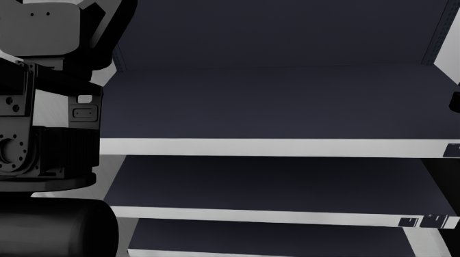
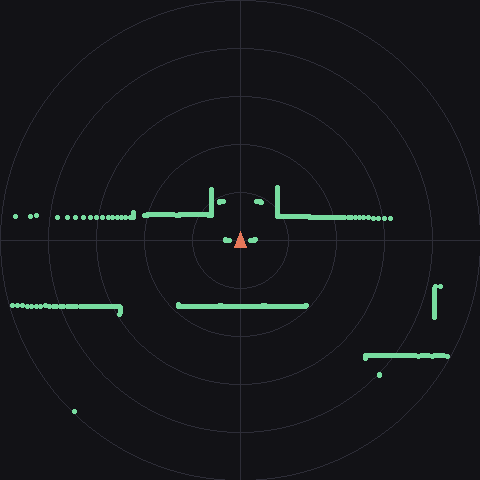

# eval-host-server — 참가자 정책 서버

VLA(Vision-Language-Action) 시뮬레이션 평가에 제출할 **참가자 정책 서버**의 골격입니다.
`BasePolicy`를 상속해 `infer()` 하나만 채우면, 통신·인코딩·인증은 골격이 처리합니다.

---

## 1. 개요

- 참가자가 이 **정책 서버**를 공인 IP에 띄우고, **평가 서버가 클라이언트로 접속**합니다
  (아웃바운드 연결은 평가 서버 쪽에서만 일어납니다 — 여러분 서버는 받기만 합니다).
- 평가 서버가 `이미지·instruction·상태`를 보내면, 여러분 서버가 `액션 청크`를 돌려주고,
  그 액션으로 시뮬레이션을 굴려 채점하는 **closed-loop** 구조입니다.
- 통신은 **WebSocket + msgpack**. numpy 배열은 `msgpack_numpy`로 dtype/shape 그대로 왕복합니다.
- **고정 Hz sim-time 스텝**이라 실시간이 아닙니다 — 추론이 느려도 시뮬은 멈춰 기다리므로
  **점수에 불리하지 않습니다**(단, 추론 1회가 30초를 넘으면 그 평가는 종료됩니다).

```
평가 서버                          여러분의 정책 서버 (이 레포)
   │  ── reset ─────────────────▶  에피소드 시작 (conf: action_dim, control_hz, max_chunk_len)
   │  ◀── ready ──────────────────
   │  ── observation ───────────▶  이미지·depth·state·scan·instruction
   │  ◀── action (T, action_dim) ─  액션 청크
   │           ⋮  (청크를 20Hz로 소진한 뒤 다음 observation)
   │  ── done ──────────────────▶  에피소드 끝 (응답 없이 연결 종료)
```

---

## 2. 통신 규약

메시지는 전부 dict이고 msgpack으로 직렬화됩니다. **모르는 키·모르는 type은 무시**하세요 —
평가 서버가 나중에 필드를 늘려도 여러분 서버가 죽지 않게 하는 규칙입니다.

```
수신 {"type":"reset", "episode_id","task_id","instruction","conf","server_info"}
                                  → 송신 {"type":"ready"}
수신 {"type":"observation", "sim_time","images","head_l_depth"(선택),"state","scan"(선택),"instruction"}
                                  → 송신 {"type":"action", "actions": (T, action_dim) float32
                                          또는 {"joint_q","lift","mobile"} 구조화 dict}
수신 {"type":"done", "reason": ..., "server_info": ...}   → 응답 없이 연결 종료
```

### 입력 (observation) — 여러분 서버가 받는 것

골격(`server.py`)이 수신 즉시 디코드해 `infer(obs)`에 넘기므로, 정책 코드는 항상 numpy
배열만 봅니다. `obs` dict의 필드:

**① 이미지 `images`** — 실기 SDK 기록 해상도로 **고정**(선택 기능 없음). 전송은 JPEG, `infer`가
꺼낼 때 `(H, W, 3) uint8`로 디코드됩니다(안 꺼낸 캠은 디코드 비용 0). 크롭/리사이즈 등 전처리는
정책 몫입니다.

| 키 | 해상도 (H×W) | 카메라 | 샘플 |
|---|---|---|---|
| `head_l` | 376×672 | 머리 ZED Mini **좌안** |  |
| `wrist_l` | 240×424 | **왼손목** RealSense D405 |  |
| `wrist_r` | 240×424 | **오른손목** RealSense D405 |  |

**② head depth `head_l_depth`** — 머리 카메라의 depth. `(376, 672) float32` **미터**, `0 = 무효`
(측정 불가). 키 이름이 `head_l`(좌안)과 짝이라 **같은 픽셀 좌표가 같은 광선**을 뜻합니다.
depth가 없는 태스크에는 키 자체가 없습니다.

> ⚠️ **이 depth는 시뮬레이터의 이상화(idealized) depth입니다.** 실기 ZED Mini의 스테레오
> depth와 달리 노이즈·구멍(무텍스처/반사면)·시차 한계가 전혀 없는 완벽한 값입니다. 이 값에
> 그대로 의존하는 정책은 실기에서 성능이 떨어집니다 — 학습 시 노이즈/드롭아웃 증강을 권장합니다.
> **손목(wrist)에는 depth가 제공되지 않습니다 — head만.**

아래는 사람이 보기 위해 정규화한 미리보기입니다(가까울수록 흰색, 무효는 검정). 실제 전달값은
미터 단위 float32 배열입니다.


**③ 상태 `state`** — 구조화 dict `{"joint_q":[18], "lift":[1], "mobile":[3]}` float32.
`joint_q` 순서는 `arm_r7, arm_l7, grip_r, grip_l, head2`(그리퍼는 연속 각도), `lift`는 리프트,
`mobile`은 베이스 odom(vx, vy, ωz). 속도(qdot)·목표물 참값 포즈는 **주지 않습니다**(비전 태스크
성립을 위해).

**④ LiDAR `scan`** — `float32[960]`, 병합 2D 스캔(거리, 미터). 로봇 몸통(base_link) 기준 **360°**
를 960빈으로(0.375°/빈) 나눈 값이고, **빈 i의 각도 = -π + i·(2π/960)** (`atan2(y, x)`, x=전방·
y=좌). 값은 0.05~20 m, **20 m ≈ 무반사**(그 방향에 20 m 안쪽 장애물 없음). 실기 라이다 2기를
`base_link` 프레임으로 병합한 것과 같은 규약입니다. **LiDAR가 있는 태스크에서만** 실리고,
없으면 키 자체가 없습니다.

아래는 top-down 시각화입니다(로봇=중앙 주황 삼각형이 전방, 링은 1 m 간격, 초록 점이 반사).
실제 전달값은 위 규약의 float32 배열입니다.



**⑤ `instruction`** — 자연어 지시(str). `sim_time`(float)도 함께 옵니다.

### 출력 (action) — 여러분 서버가 돌려주는 것

`infer(obs)`는 **액션 청크**를 반환합니다:

- `(T, action_dim)` **2차원 float32** — 전체 자유도를 채운 청크, 또는
- 구조화 dict `{"joint_q":(T,18), "lift":(T,1), "mobile":(T,3)}` — 쓰는 그룹만, 누락 그룹은
  평가 서버가 0으로 채웁니다(`action_groups()` 헬퍼 참조), 또는
- 짧은 벡터/부분 dict — `fill_action()`이 뒤를 0으로 채웁니다.

`T`는 1 이상, 평가 서버 conf의 `max_chunk_len`을 넘으면 앞에서부터 잘립니다. 청크는
`control_hz`(=20Hz)로 **동기 소진**된 뒤에야 다시 관측·추론합니다(50개 청크 = 약 2.5초 blocking).
**NaN/Inf가 있으면 에피소드가 실패**합니다. 태스크별로 허용되지 않는 자유도(예: Task B의 lift·
base)는 보내도 **평가 서버가 0으로 마스킹**합니다.

### server_info — 에피소드 경계 알림

`reset`과 `done`에만 실립니다(**관측 틱에는 절대 없습니다**). type은 `Start`·`Done` 둘뿐이고,
평가 중 진행·채점 정보는 어떤 형태로도 나가지 않습니다.

```
{"type": "Start", "info": "Task B-1"}
{"type": "Done",  "info": "Task B-3 | full marks (early stop)"}
```

`info`는 `"Task Z-N"`(태스크 문자·시도 번호 1부터) 뒤에 설명이 있으면 `" | "`로 잇습니다.
파싱은 **1회 분리 후 trim**(`info.split("|", 1)`). 추가 설명은 자연어라 내용에 기대지 마세요.

### 조기 종료 규칙 두 가지 (에피소드가 상한 틱 전에 끝나는 경우)

- **만점 조기 종료**: 채점 항목이 전부 만점인 상태가 **시뮬 2.5초** 유지되면 종료
  (`reason:"full_marks"`). 스쳐 지나가는 순간 만점은 종료 조건이 아닙니다.
- **정체 종료**: 채점 총점이 **시뮬 3분** 동안 무진전이면 종료(`reason:"stalled"` — 시작부터
  세므로 3분 내 무득점도 종료). 점수는 종료 시점까지 딴 것 그대로입니다.

### 관절 각속도 가드

받은 청크의 관절 타깃 변화율(연속 두 타깃 차이 × `control_hz`, 직전 타깃→청크 첫 타깃 포함)을
관절별 한도와 비교합니다. 한 관절이라도 한도를 넘으면 **그 청크는 통째로 무시**되고 직전 타깃이
유지된 채 시뮬 시간은 흐릅니다. 한도는 실기 FFW-SG2의 SDK 속도 제한(팔 관절 3~7 rad/s 급)에서
옵니다. 그리퍼(연속값)·모바일 베이스(속도 명령)는 검사 대상이 아닙니다. 실기가 낼 수 없는 급격한
관절 이동만 피하면 걸리지 않습니다.

---

## 3. 간단 예시 — 어떻게 채우면 되는가

`BasePolicy`를 상속해 `infer()`만 채우고 `serve_policy()`로 띄우면 끝입니다. 기존 추론 스택
(GR00T, openpi, 자체 아키텍처 등)은 `infer()` 안에서 브리지로 호출하면 됩니다.

```python
import numpy as np
from server import BasePolicy, action_groups, cli, serve_policy

class MyPolicy(BasePolicy):
    def reset(self, msg: dict) -> None:
        conf = msg["conf"]                      # action_dim, control_hz, max_chunk_len
        self.action_dim = conf["action_dim"]
        # (여기서 모델 로드·상태 초기화)

    def infer(self, obs: dict) -> np.ndarray:
        head  = obs["images"]["head_l"]         # (376,672,3) uint8 — 꺼낼 때 디코드
        wrist = obs["images"]["wrist_r"]        # (240,424,3) uint8
        depth = obs.get("head_l_depth")         # (376,672) float32 미터, 0=무효 (없을 수 있음)
        scan  = obs.get("scan")                 # float32[960] LiDAR 거리 (없을 수 있음)
        state = obs["state"]                    # {"joint_q":[18], "lift":[1], "mobile":[3]}
        text  = obs["instruction"]

        # ── 여기서 여러분의 모델을 호출해 액션 청크를 만듭니다 ──
        chunk = my_model(head, wrist, depth, state, text)   # (T, action_dim) float32
        return chunk

        # 일부 자유도만 쓰려면 구조화 dict로 반환해도 됩니다 (나머지는 평가 서버가 0으로 채움):
        # return action_groups(joint_q=my_joint_targets)    # (T, 18)

if __name__ == "__main__":
    args = cli()
    serve_policy(MyPolicy(), args.host, args.port, args.token, args.certfile, args.keyfile)
```

- **이미지는 꺼내는 순간 디코드**됩니다 — 손목 캠을 안 쓰면 그 캠은 디코드 비용이 들지 않습니다.
- **부분 지정**: `fill_action({"arm_r": q7, "gripper_r": -1.0}, action_dim)`처럼 구간 이름으로
  일부만 줘도 됩니다(`ACTION_SLICES` 참조).
- 반환은 **(T, action_dim) float32** 또는 구조화 dict. NaN/Inf 금지.

---

## 4. 샘플 서버 실행 — `demo_server.py`

`demo_server.py`는 **통신 규약만 맞춰 제로 액션을 돌려주고, 평가 서버가 보내온 관측을 파일로
저장**하는 도구입니다. 정책 로직은 없습니다 — **자기 서버 배선을 검증**하고, 실제로 어떤 관측이
오는지(위 샘플 이미지가 이렇게 나옵니다) 눈으로 확인하는 용도입니다.

```bash
python demo_server.py --port 8000 --token "$(cat token.txt)" --save-dir ./received
```

동작:
- 매 에피소드 **첫 관측**을 `--save-dir`에 저장합니다(에피소드별 하위 폴더):
  `head_l.png` · `wrist_l.png` · `wrist_r.png`(RGB), `head_l_depth.png`(16-bit mm 원본) +
  `head_l_depth_view.png`(미리보기), `scan.npy`(LiDAR 원본 float32[960]) + `scan_view.png`
  (top-down 미리보기), `obs.json`(sim_time·instruction·state·scan 요약).
- 액션은 **전부 0**(제로 커맨드) — 로봇은 리셋 포즈를 유지합니다. 채점은 0점이지만, 관측
  확인과 배선 검증에는 충분합니다. 이걸로 파이프라인이 붙는 것을 확인한 뒤 §3처럼 여러분
  모델을 `infer()`에 연결하세요.

저장된 `obs.json` 예:

```json
{ "sim_time": 0.0, "instruction": "Sort the objects in the basket: ...",
  "images": { "head_l": [376,672,3], "wrist_l": [240,424,3], "wrist_r": [240,424,3] },
  "state":  { "joint_q": [18], "lift": [1], "mobile": [3] },
  "has_head_l_depth": true, "has_scan": true, "scan_len": 960 }
```

---

## 5. 유의사항 (참가 필수 조건)

- **공인 IP + 포트포워딩 필수.** 평가 서버가 여러분 서버로 **접속**하므로, 서버는 공인 IP(또는
  도메인)의 열린 포트에 있어야 합니다. 방화벽/공유기에서 해당 포트 **인바운드를 허용**하세요.
  사설 IP(192.168.x, 10.x 등)·NAT 뒤 주소는 평가 서버가 도달할 수 없어 제출이 실패합니다.
- **토큰을 꼭 거세요.** 제출 페이지의 **"토큰 확인"**에서 제출 토큰을 받아 `--token`으로 겁니다.
  평가 서버는 `Authorization: Bearer <토큰>`을 검증하고 그 외 접속은 401로 거부합니다.
  없으면 주소를 아는 누구나 여러분 모델의 출력을 뽑아 가거나, 다른 팀이 여러분 서버 주소를
  제출해 점수를 가져갈 수 있습니다.
  ```bash
  echo "tok_EXAMPLE_0000000000000000" > token.txt   # 발급받은 실제 토큰으로 교체 (.gitignore 포함)
  python demo_server.py --port 8000 --token "$(cat token.txt)" --save-dir ./received
  ```
- **평가 내내 서버를 켜 두세요.** 제출 → 큐 대기 → 평가(에피소드 여러 회, 정책에 따라 수십 분)
  동안 서버가 살아 있어야 합니다. 평가 중 서버가 꺼지면 연결이 끊겨 그 평가는 실패합니다.
- **연결 처리**: 연결은 에피소드 내내 유지됩니다(매 스텝 재연결 금지). **`done` 수신 또는 연결
  종료를 둘 다 에피소드 끝으로** 처리하세요 — 강제 중단(벽시계 타임아웃·프로세스 킬)에서는
  `done`이 못 나가고 연결만 끊깁니다. `Done`만 기다리며 상태를 붙잡지 마세요.
- **추론 30초 한도**: 시뮬은 추론 동안 대기하므로 느려도 점수에 불리하지 않지만, **한 번의
  추론이 30초를 넘으면** 그 평가는 `policy_timeout`으로 종료됩니다.
- **TLS(wss://) 권장.** `ws://`는 평문이라 공유 망(연구실 LAN·기숙사·카페)에서는 같은 망의
  타인이 토큰을 볼 수 있습니다. 자동화 스크립트로 인증서 생성부터 제출값 출력까지 한 번에:
  ```bash
  ./wss_setup.sh <공인 IP 또는 도메인>
  # → cert.pem/key.pem 생성 + 제출 페이지에 등록할 "서버 주소·인증서 지문"·실행 명령 출력
  ```
  도메인이 있으면 정식 인증서(Let's Encrypt 등)로 `wss://도메인:포트`, 없으면 self-signed
  인증서를 만들어 **지문**을 제출 페이지에 함께 등록하세요(평가 서버는 등록된 지문과 일치하는
  인증서만 신뢰). 인증서를 새로 만들면 지문이 바뀌니 제출 페이지도 갱신하세요. `key.pem`은
  절대 공유 금지.

### 참가·제출 흐름

**참가신청(개인정보 동의 필수) → 운영진 승인 → 로그인 → 정책 서버 기동 → 제출**

1. 참가신청: 팀 정보·연락처를 입력하고 개인정보 수집·이용에 동의. **승인 전에는 제출이 거부**됩니다.
2. 승인 후 로그인 → 정책 서버를 공인 IP의 열린 포트로 기동(위 유의사항).
3. 제출 페이지에서 서버 주소를 `ws://<공인IP>:<포트>`(또는 `wss://`)로 등록. wss면 인증서 지문 칸에 지문 입력.
4. **"토큰 확인"**으로 제출 토큰을 받아 `--token`으로 서버에 겁니다.
5. 제출하면 평가가 큐에 들어가고, 진행 상태·점수는 제출 페이지에서 확인합니다.

의존성: `pip install websockets msgpack msgpack-numpy numpy pillow`
(선택) `pip install simplejpeg` — 설치돼 있으면 JPEG 디코드에 자동으로 씁니다(2–3× 빠름).
